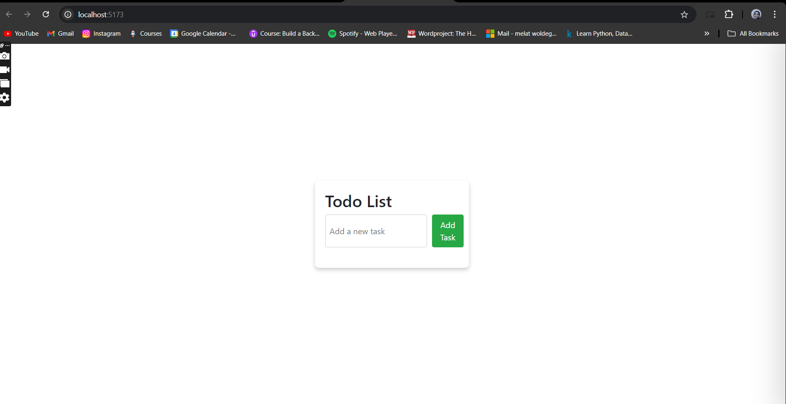
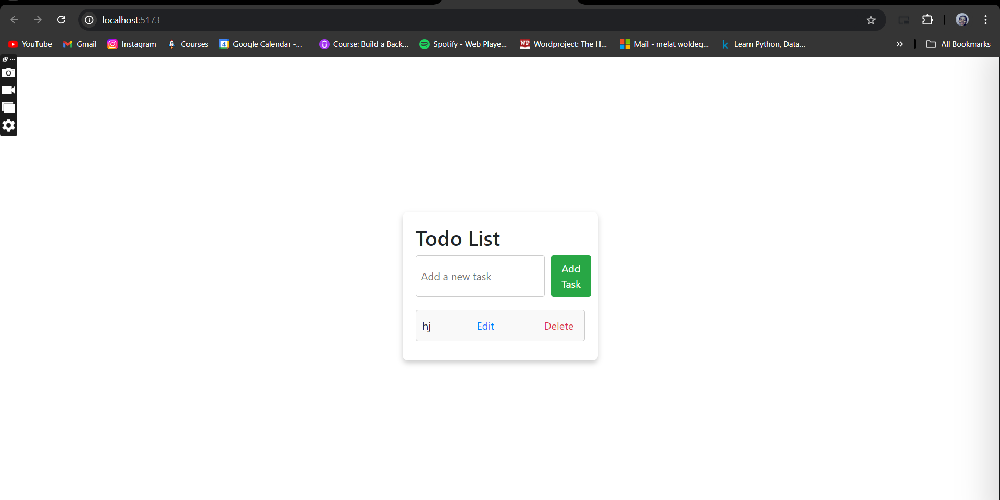

# React ToDo List

A simple ToDo List application built with React, TypeScript, and Vite.

## Features

- Add new tasks
- Mark tasks as completed
- Delete tasks
- Responsive design

## Installation

1. Clone the repository:
    ```sh
    git clone https://github.com/Melatwolde/learningpath-tasks.git
    cd task4
    ```

2. Install dependencies:
    ```sh
    npm install
    ```

3. Start the development server:
    ```sh
    npm run dev
    ```

4. Open your browser and navigate to `http://localhost:5173/`.

## Usage

- To add a new task, type the task description in the input field and click the "Add Task" button.
- To mark a task as completed, click on the task.
- To delete a task, click the delete button next to the task.

## Screenshots

To add screenshots to your README, place the screenshot images in your project directory (e.g., in a folder named `screenshots`) and use the following markdown syntax to include them:

```markdown

