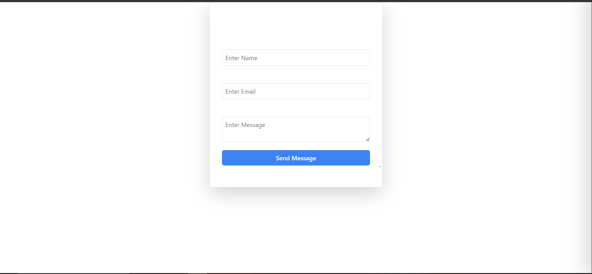

# Contact Form

## Description
This project is a simple contact form built using React and the `useForm` hook from `react-hook-form`. The form includes fields for Name, Email, and Message, with validation for required fields and email format.

## Features
- Form validation for required fields and email format.
- Error messages for invalid inputs.
- Responsive UI.


## Installation

1. Clone the repository:
    ```sh
    git clone https://github.com/Melatwolde/learningpath-tasks.git
    cd task5
    ```

2. Install dependencies:
    ```sh
    npm install
    ```

3. Start the development server:
    ```sh
    npm run dev
    ```

4. Open your browser and navigate to `http://localhost:5173/`.


# React ToDo List

A simple ToDo List application built with React, TypeScript, and Vite.

## Features

- Add new tasks
- Mark tasks as completed
- Delete tasks
- Responsive design

## Installation

1. Clone the repository:
    ```sh
    git clone https://github.com/Melatwolde/learningpath-tasks.git
    cd task4
    ```

2. Install dependencies:git add README.md
    ```sh
    npm install
    ```

3. Start the development server:
    ```sh
    npm run dev
    ```

4. Open your browser and navigate to `http://localhost:5173/`.

## Usage

- To add a new task, type the task description in the input field and click the "Add Task" button.
- To mark a task as completed, click on the task.
- To delete a task, click the delete button next to the task.

## Screenshots

```markdown


